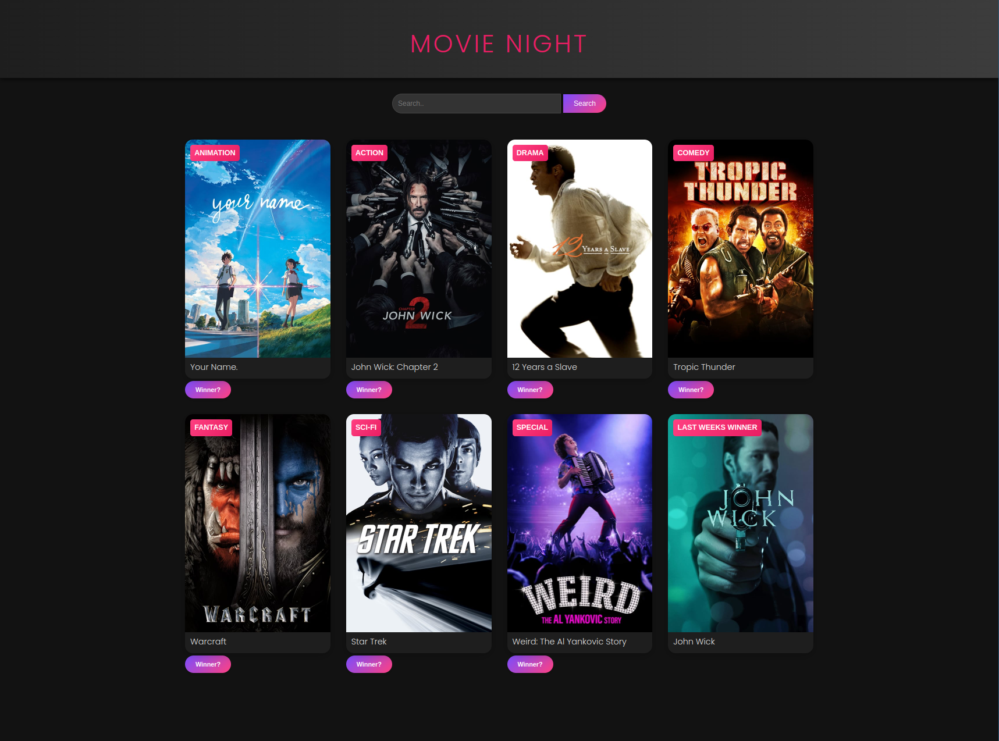
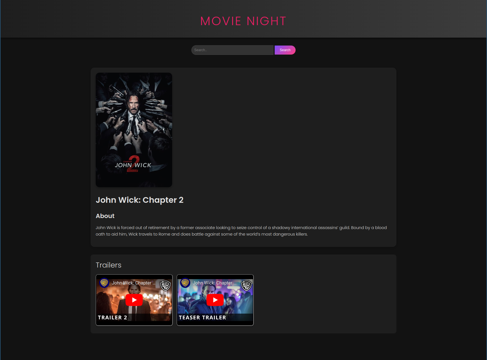
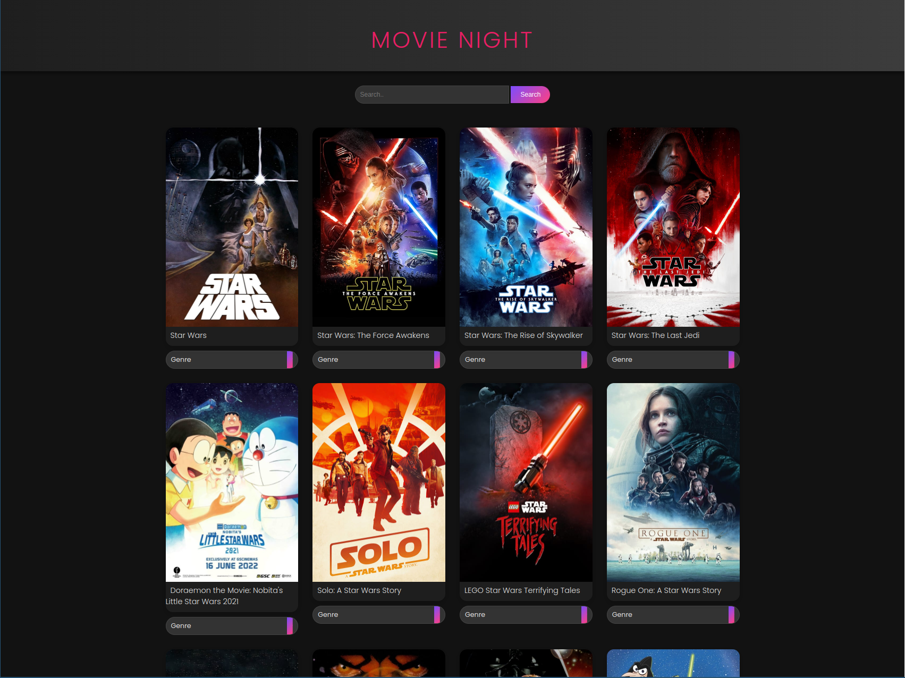
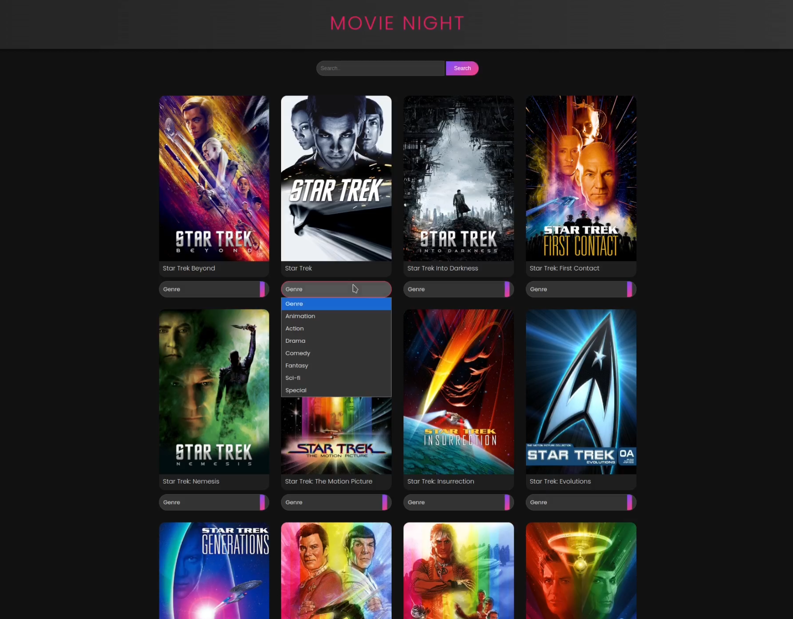
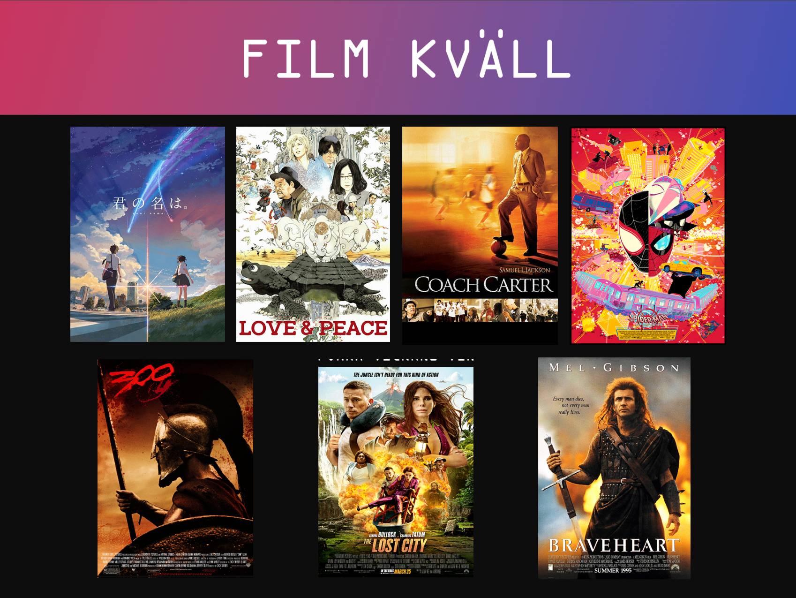
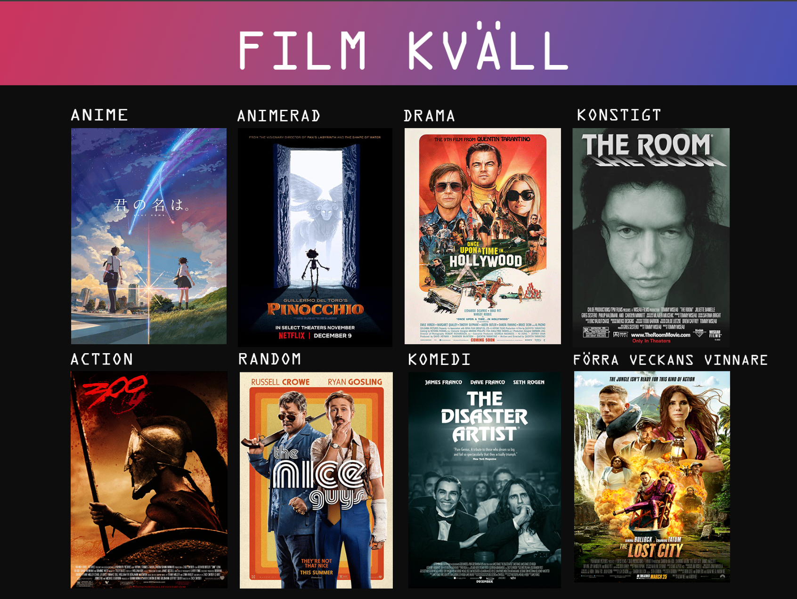
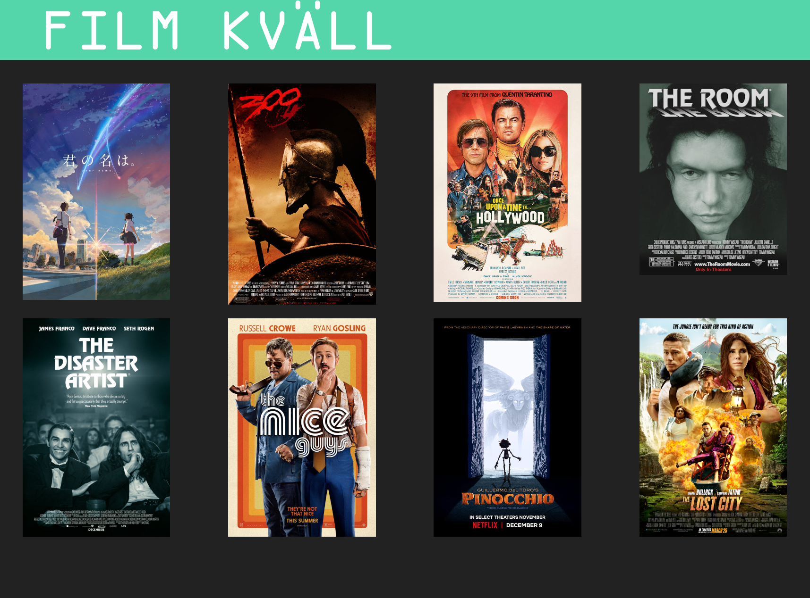

# Movie_Night
This is an improvement on an old idea called Movie Night (or Film kväll). It started as a way to pre-select movies for my girlfriend and me, aiming to minimize the time spent choosing films. Instead of wasting the evening searching for something to watch—even though we had plenty of good options—we often got overwhelmed by the sheer number of choices across multiple streaming sites (Netflix, Max, Disney+, etc.). This led to a lot of wasted time browsing instead of actually watching something.

To avoid this, I came up with the idea to pre-select a few good movies that I wanted to watch, ones that were almost guaranteed to be enjoyable. To avoid wasting so much time, I’d quickly pick the first good movie I found. If it was a comedy, I’d then mix things up by choosing the next movie from a different genre, like drama. I continued this process until I had about 6 or 7 movies, ideally from a variety of genres. Then, I’d go into Photoshop, add pictures of the posters, and include links to the trailers. I’d present these to my girlfriend, and she’d choose one to watch—this way, we’d avoid endlessly searching for more movies. If we didn’t like the movie, we could easily switch to one of the others. It was a solid concept, and it worked every time. My girlfriend thought it was a cute idea, and it gave her the feeling of going to a cinema, getting to look at the evenings line up of movies.

So, why update this? Didn't the old version work? Well, the previous version required a lot of manual labor: finding trailers, posters, and linking everything to the HTML page. Plus, the design wasn’t great. However, after reading about movie APIs, I found a solution. With the help of the TMDB API and an updated interface, all those problems disappeared. Now, if I want to add a movie, I can simply search for it and add it to the Movie Night page. I get all the information I need—trailers, posters, and a basic summary—without giving away too much detail. It’s almost too easy! What used to take a solid 15-30 minutes to gather movie info and download posters now takes less than 30 seconds and with just the click of a button.

Sounds great, right?

But here's where the plot thickens. What started as a harmless idea to simplify movie nights became a devious plot to get her to watch the movies I want to watch. By creating a product package with love and nerdy cuteness, I made her feel like she’s the one picking the movie. But while she’s focused on making her decision, she doesn’t realize that, although she thinks she’s choosing, she’s actually just picking from a selection of movies I want to watch. MOUHAHAHAHAHA! (Evil laughing)

However, now that I’ve updated Movie Night, I fear she’ll want to add her own movies to the mix. With the ease of finding and selecting movies, it’s almost too convenient. I just hope she doesn’t discover how simple the features are or ask if she can pick the movies for our movie night. (Nervous breathing)

To sum up, I’ve successfully automated a tedious process and made it more streamlined and user-friendly. It’s reduced the time to prepare for Movie Night by probably 1000000%!(Don’t trust me on that math, but it’s way faster.) But at what cost? Now my girlfriend could easily use this tool, without needing to know any HTML or Photoshop. I can only hope she remains blissfully unaware. (Nervously sobbing over my masterful creation)

## Features

- **Easy Movie selection**: Find the movie you want to add by simply searching for it and add it

## Usage

Once the web application is running, you can use the following functions:

- **Search**: A Search function to easily find the movie you want to add to your movies night.
- **Display Movie aboutpage**: By simply clicking on the poster for any of your selected or searched movies, you will display the AboutPage, where you can learn more about your selected movie.
- **Search and Switch**: Simply search for a movie you are thinking about adding and search for it, When you found the movie you want to add, select the switch button and hit the genre that the movies is going to represent for your Movie Night.
- **Select a Winner**: TO remember what movie won and what movies you watched last week, you can selet a winner by hitting the winner button.

### Example Usage

Here are some Pictures demonstrating the application:

- **Movies**:  
  

- **About Movie**:  
  

- **Searching for Movies**:  
  

- **Switching a Movie**:  
  

## Code Structure

- **Json File**: The server reads from and writes to a json file located in the root folder to get acesses to current or previously selected movies.
- **In-Memory Management**: Movies are managed in memory during the session and saved during switch.
- **UI States**: The user interface supports different states: main page inlcudes selcted movies for current movie night and previous movie night winner. About page that presents all movie information, name, about, trailers.

## Tools

- Golang for server management and api data colletions.
- Html & Css for interaction and apperance.
- JavaScript for enhanced functionaltiy.
- API TMDB for Movie data https://developer.themoviedb.org/reference/intro/getting-started

## Previous version
https://github.com/Thunderboi1337/Old_Movie_Night_Project

- **Original Photoship html version**:

  

- **Second version Photoship html version**:  

  

### Going from photoshop to html

- **First bad basic html version**:  

  

## License

Feel free to use and modify this project as you see fit. Enjoy!
